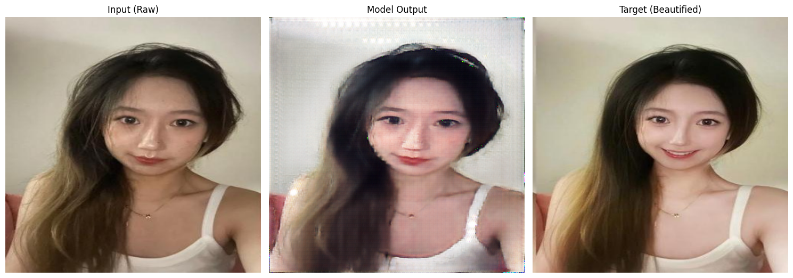

# Face Beautification GAN

A deep learning model that transforms facial images into their beautified versions while preserving identity. This project implements a hybrid CNN-Transformer architecture with a GAN-based approach for photographic face beautification.

## Overview

This project implements a state-of-the-art face beautification system using a hybrid CNN-Transformer architecture and Generative Adversarial Network (GAN) approach. The model is designed to:

- Transform ordinary facial photos into professionally beautified versions
- Preserve the identity of the subject
- Generate natural-looking results that respect facial features
- Learn from paired before/after examples

## Architecture

The system uses a hybrid architecture with:

- **Generator**: CNN encoder, Transformer bottleneck with DyT (Dynamic Tanh) normalization, and CNN decoder with skip connections
- **Discriminator**: Conditional PatchGAN with spectral normalization
- **Loss Components**: Adversarial loss, L1 reconstruction loss, perceptual loss, and total variation loss

The implementation is based on a recent [research paper](https://arxiv.org/abs/2503.10622v1) that introduces Dynamic Tanh (DyT) as a replacement for layer normalization in transformer architectures.

## Requirements

- Python 3.8+
- PyTorch 1.9+
- CUDA-compatible GPU (multi-GPU training recommended)
- See `requirements.txt` for full dependencies

## Installation

```bash
git clone https://github.com/yourusername/face-beautification.git
cd face-beautification
pip install -r requirements.txt
```

## Data Preparation

The training pipeline expects paired before/after images in the following directory structure:

```
data/
├── raw/      # Original (before) images
└── aft/      # Beautified (after) images
```

Both directories should contain corresponding images with the same filenames or numerical indices (e.g., `001.jpg` in both directories).

## Training

This model is designed for multi-GPU training using PyTorch's Distributed Data Parallel (DDP). We recommend using at least 2 GPUs (V100 or better) for reasonable training times.

```bash
# Run distributed training on all available GPUs
bash scripts/train_distributed.sh
```

You can modify the training parameters in `config.py`.

## Inference

To beautify new images:

```bash
python inference.py --input path/to/image.jpg --output path/to/output.jpg --model path/to/model_checkpoint.pth
```

## Results

The model generates high-quality beautified portraits while preserving identity:



## License

This project is licensed under the MIT License - see the [LICENSE](LICENSE) file for details.

## Acknowledgments

- This implementation uses Dynamic Tanh (DyT) based on the paper "Transformers without Normalization" (Zhu et al., 2025)
